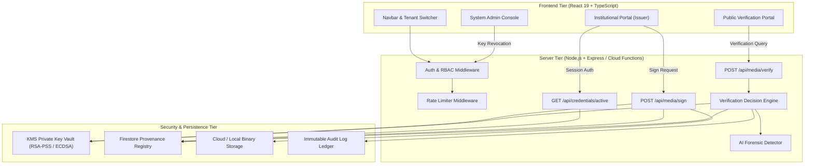
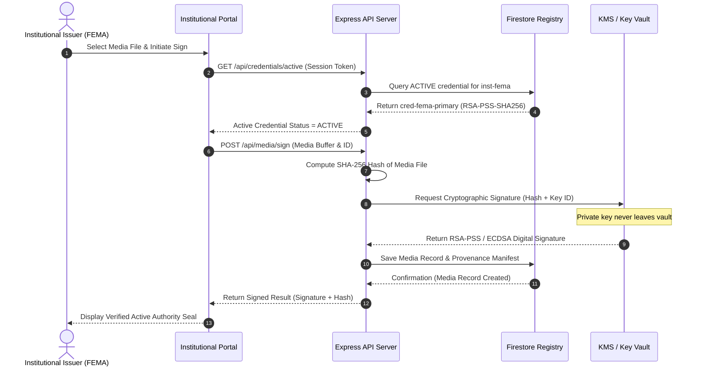
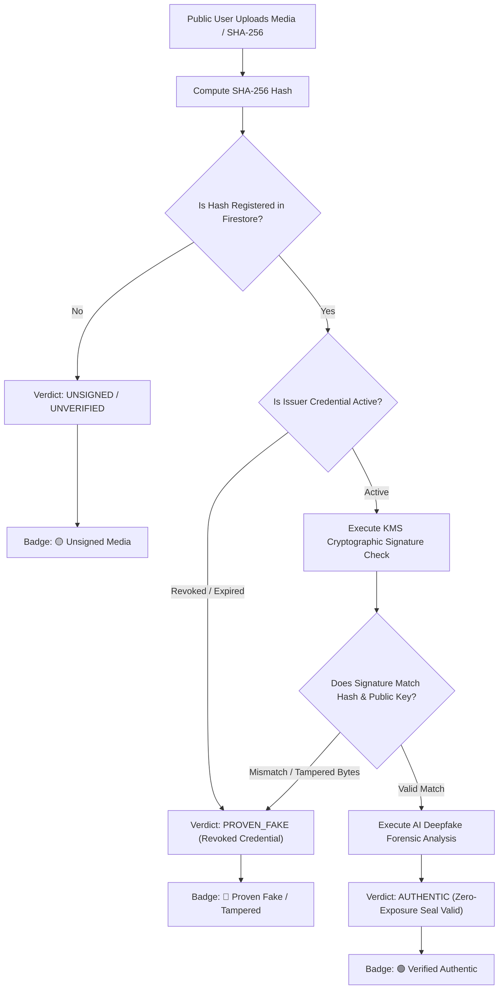

# 🛡️ TruthSeal — Media Authenticity Verification Platform
## Technical Documentation & Architecture Manual

TruthSeal is an enterprise-grade, multi-tenant media authenticity verification platform designed for government agencies, emergency response authorities, healthcare organizations, and public news outlets (e.g., FEMA, WHO, NOAA).

The platform safeguards media integrity against deepfakes, unauthorized manipulation, and misinformation using **Cryptographic KMS Digital Signatures (RSA-PSS / ECDSA)**, **Immutable Provenance Logs**, **AI Forensic Analysis**, and **Zero-Exposure Key Management**.

---

## 📐 1. System Architecture & Component Hierarchy

### Visual System Architecture



### Directory Structure & Component Organization

```
media-authenticity-verification-platform/
├── frontend/                       # React 19 Single Page Application
│   ├── App.tsx                     # Main Router & Global State Controller
│   ├── index.css                   # Core Design Tokens & Glassmorphism System
│   ├── components/
│   │   ├── portals/                # Portal Feature Views
│   │   │   ├── InstitutionalPortal.tsx   # Active Issuing Authority Dashboard & Media Signer
│   │   │   ├── PublicVerification.tsx    # Public Verification Interface & Deepfake Inspector
│   │   │   ├── AdminConsole.tsx          # Authority Lifecycle, Key Revocation & Audit Logs
│   │   │   └── LoginPage.tsx             # RBAC Authentication & Role Switcher
│   │   └── ui/                     # Shared UI Components
│   │       ├── Navbar.tsx                # Dynamic Header & Tenant Selector
│   │       ├── ArchitectureViewer.tsx    # Interactive Data Flow Diagram
│   │       └── CyberBackground.tsx       # Animated Matrix Background
│   └── services/                   # Frontend API Services
├── backend/                        # Node.js / Express Application Server
│   ├── db.ts                       # Dual-Mode Database Abstraction (Firestore + InMemoryDB)
│   ├── config/
│   │   └── envValidator.ts         # Environment Configuration & Security Validator
│   ├── firestore/                  # Firestore Collections & Repositories
│   │   ├── institutionRepository.ts # Institution CRUD & Metadata
│   │   ├── credentialRepository.ts  # Cryptographic Credential Registry
│   │   ├── mediaRepository.ts       # Media Provenance & SHA-256 Hashes
│   │   ├── verificationLogRepository.ts # Immutable Audit Logs
│   │   └── seedInitialData.ts       # Initial Authority Seeder (FEMA, WHO, NOAA)
│   ├── middleware/
│   │   ├── authMiddleware.ts        # Bearer ID Token Auth & Session Context
│   │   └── rateLimiter.ts           # Sliding Window API Rate Limiter
│   ├── storage/
│   │   └── mediaStorageService.ts   # Binary Media Storage (Cloud Storage + Local)
│   ├── utils/
│   │   ├── logger.ts                # Structured JSON Logger with Secret Redaction
│   │   ├── retry.ts                 # Backoff & Retry Logic
│   │   └── timeout.ts               # Async Timeout Guard
│   └── backups/                     # Offline Backup Engines & Utilities
├── functions/                      # Firebase Cloud Functions Engine
│   └── src/
│       ├── auth/                   # Authentication & Authorization Services
│       ├── credentials/            # Credential Management Services
│       ├── media/                  # KMS Signing & Verification Pipeline
│       └── verification/           # Deepfake & Verification Decision Engine
├── tests/                          # Automated Regression & Test Suites
│   ├── activeAuthority.test.ts     # Active Authority & Tenant Isolation Suite
│   ├── bugfixes.test.ts            # Bug Regression & KMS Lifecycle Suite
│   └── firestore.test.ts           # Full Baseline Platform Suite (88 Tests)
├── scripts/
│   ├── prototype-audit.ts          # Master 28-Scenario Prototype Audit Runner
│   └── run-tests.ts                # Automated Dual-Engine Test Harness
└── server.ts                       # Express Production Server & Vite SSR Middleware
```

---

## 🏛️ 2. Core Security Guarantees & Active Issuing Authority

### Media Signing Sequence Diagram



### Zero-Exposure KMS Architecture
1. **Private Key Protection**: Private keys are stored strictly inside a protected Key Management Service (KMS) or local secure vault (`NodeCryptoKMSProvider`). Private key bytes are **NEVER** exposed via API responses or frontend payloads.
2. **Dynamic Active Authority Resolution**:
   - Institutional Issuers query `GET /api/credentials/active` to derive their current authorized credential based on authenticated session context.
   - If an institution's active credential is `REVOKED` or `EXPIRED`, signing operations are immediately blocked with HTTP 403 / non-active status errors.
3. **Multi-Tenant Isolation**:
   - Institutional Issuers (e.g. `FEMA`) are strictly isolated to their own tenant scope.
   - `FEMA` cannot issue signatures using `WHO` or `NOAA` credentials, and cross-institution storage deletions are strictly forbidden.

---

## 🔍 3. Verification Decision Engine & Verdicts

### Verification Pipeline Flowchart



### Verdict Summary Table

| Verdict | Trigger Condition | Display Badge |
| :--- | :--- | :--- |
| **`AUTHENTIC`** | Valid KMS cryptographic signature matching the media SHA-256 hash issued by an `ACTIVE` credential. | 🟢 **Verified Authentic** |
| **`PROVEN_FAKE`** | A media record exists for the hash, but cryptographic signature verification fails (indicating byte-level tampering). | 🔴 **Proven Fake / Tampered** |
| **`UNSIGNED`** | No cryptographic signature is present or media SHA-256 is unanchored in the registry. | 🟡 **Unsigned / Unverified** |

---

## ⚡ 4. REST API Endpoint Reference

### 🔐 Authentication & Session
- `POST /api/auth/login`
  - **Body**: `{ "role": "INSTITUTIONAL_ISSUER", "email": "admin@fema.gov", "institutionId": "inst-fema" }`
  - **Response**: `{ "status": "SUCCESS", "token": "...", "user": { ... } }`

### 🏛️ Credentials & Active Authority
- `GET /api/credentials/active`
  - **Headers**: `Authorization: Bearer <token>` or `x-institution-id: inst-fema`
  - **Response**: `{ "status": "ACTIVE", "credential": { "id": "cred-fema-primary", "algorithm": "RSA-PSS-SHA256", "status": "ACTIVE" } }`

- `POST /api/credentials/revoke` *(System Admin Only)*
  - **Body**: `{ "credentialId": "cred-fema-primary", "reason": "Key compromise rotation" }`
  - **Response**: `{ "status": "REVOKED", "credentialId": "cred-fema-primary" }`

### 📝 Media Signing & Storage
- `POST /api/media/upload`
  - **Multipart**: `file`, `institutionId`
  - **Response**: `{ "mediaId": "med-123", "sha256Hash": "a3f...", "storagePath": "..." }`

- `POST /api/media/sign`
  - **Body**: `{ "mediaId": "med-123", "institutionId": "inst-fema" }`
  - **Response**: `{ "status": "SIGNED", "signature": "3b...", "credentialId": "cred-fema-primary" }`

### 🔍 Public Verification
- `POST /api/media/verify`
  - **Multipart**: `file` or **JSON**: `{ "sha256Hash": "a3f..." }`
  - **Response**: `{ "verdict": "AUTHENTIC", "institution": { "name": "FEMA" }, "deepfakeScore": 0.02, "signatureValid": true }`

---

## 🧪 5. Local Development & Verification Workflows

### Running the Application
```bash
# Start local Express server & Vite frontend
npm run dev
# App opens on: http://localhost:3000
```

### Running Test Suites
```bash
# Run 121 automated backend & platform unit/integration tests
npm test

# Run 28-scenario master prototype audit
npx tsx scripts/prototype-audit.ts

# Run tests against live Firebase Emulators
npm run test:emulator
```

### Building for Production
```bash
# TypeScript Typecheck
npm run lint

# Build Vite frontend & esbuild server bundle
npm run build
```

---

## 🚀 6. Deployment Strategy

- **Vercel**: Deployed via root `vercel.json` and static bundle output in `dist/`.
- **Firebase Hosting & Cloud Functions**: Functions built under `functions/dist/` and deployed via `firebase.json`.
- **GitHub Actions CI/CD**: Workflow [.github/workflows/ci.yml](file:///.github/workflows/ci.yml) enforces typecheck (`npm run lint`), build (`npm run build`), and Firebase emulator tests on every push to `main`.
